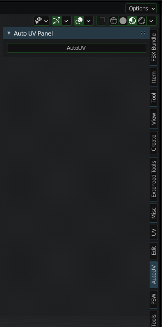

This is a simple bridge to use MinistryOfFlat console variant directly through blender.
Currently Blender 3.0 is not supported yet but 2.8x and 2.9x should all work.

The plugin simply exports the currently selected objects, then starts the UnwrapConsole3.exe with the exported files as the target, then reimports, transfers the uv channel and deletes the intermediary export/import object again.
It's super basic, but it works pretty reliably. It doesn't have any options to control the unwrapping process yet.
You also need the more expensive license of MinistryOfFlat though, to get the console variant of the program.

And there's one possible issue to look out for and that's the license file that MoF uses, needs to be in the correct folder.
This is also different depending on if you use the portable version of blender or the installed one.
I use windows 10 and the portable version of blender which i save in my documents folder (this is important!) and the license file sits next to the blender.exe.
If you use the installed version of blender you need to put the license file next to the python.exe in blenders install directory.

To install the Addon just copy the MinistryOfFlatBridge folder into your blender addons directory and activate it in the Blender Addon Menu.

You can then see the panel when selecting an object in object mode:

